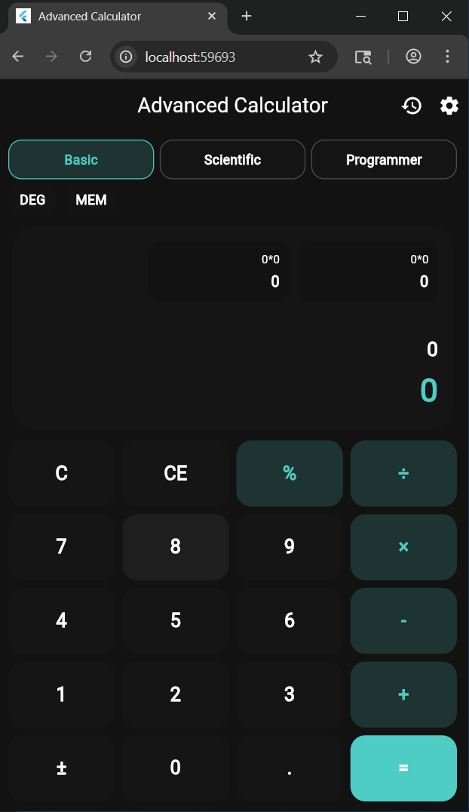
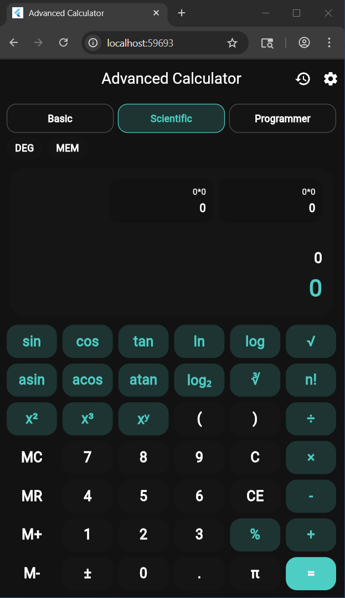
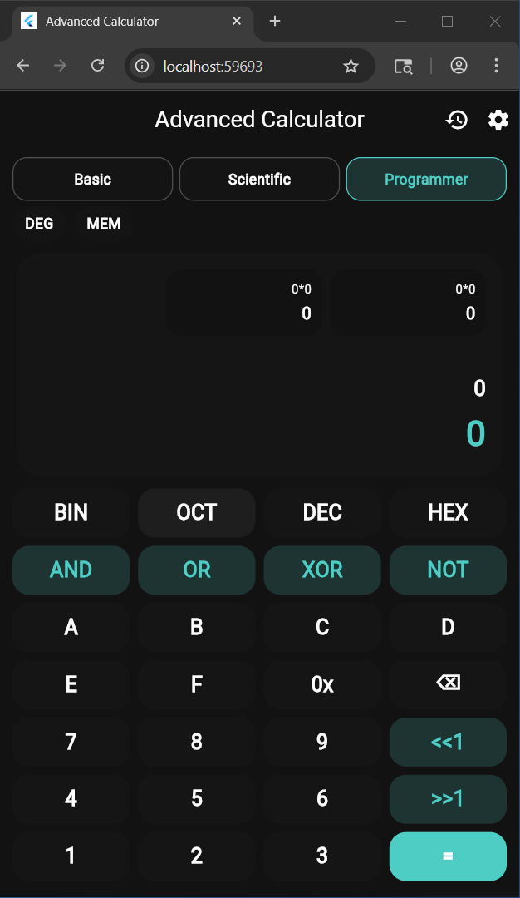
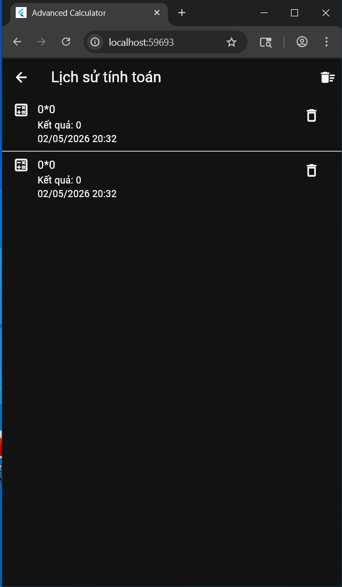
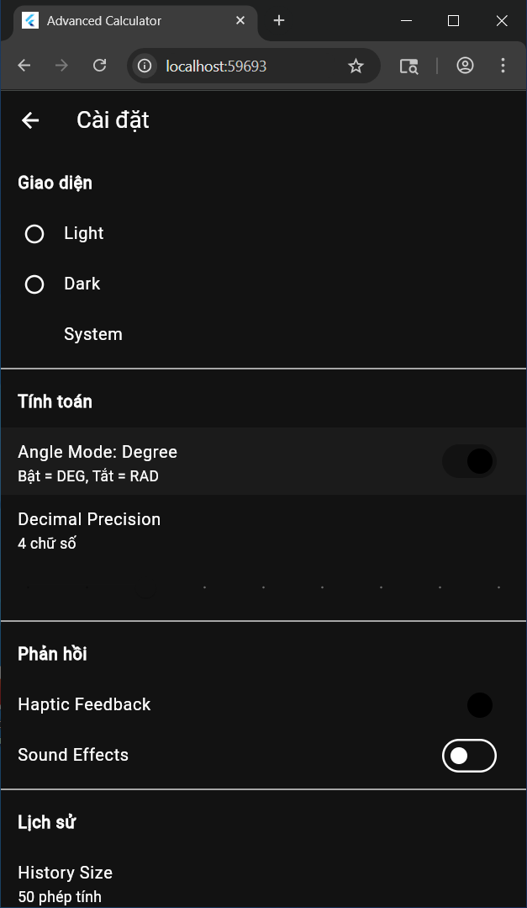

# Lab 3 - Advanced Calculator

## 1. Thông tin bài làm

- Môn học: Lập trình Flutter
- Bài thực hành: Lab 3 - Advanced Mobile Calculator
- Sinh viên: Lê Viết Thắng
- MSSV: 2224802010263
- Tên project: `AdvancedCalculator_2224802010263_LeVieThang`

Ở bài thực hành này, em xây dựng một ứng dụng máy tính nâng cao bằng Flutter. Ứng dụng không chỉ thực hiện các phép tính cơ bản mà còn hỗ trợ tính toán khoa học, chế độ lập trình, lưu lịch sử, lưu cài đặt và kiểm thử phần xử lý biểu thức.

## 2. Mục tiêu bài thực hành

Theo yêu cầu của đề, ứng dụng cần có các nội dung chính sau:

- Quản lý trạng thái bằng Provider.
- Tính biểu thức có thứ tự ưu tiên và dấu ngoặc.
- Hỗ trợ các hàm khoa học như lượng giác, logarit, căn, lũy thừa.
- Có ba chế độ: Basic, Scientific và Programmer.
- Có lịch sử tính toán và lưu dữ liệu cục bộ.
- Có chức năng bộ nhớ `M+`, `M-`, `MR`, `MC`.
- Có màn hình cài đặt cho theme, độ chính xác thập phân, DEG/RAD.
- Có unit test cho các phép tính quan trọng.

## 3. Các chức năng đã hoàn thành

Ứng dụng hiện có các nhóm chức năng sau:

- Basic mode: cộng, trừ, nhân, chia, phần trăm, đổi dấu.
- Scientific mode: `sin`, `cos`, `tan`, `asin`, `acos`, `atan`, `ln`, `log`, `log₂`, `√`, `∛`, `x²`, `x³`, `xʸ`, `π`, `e`, `n!`.
- Programmer mode: chuyển đổi BIN/OCT/DEC/HEX, `AND`, `OR`, `XOR`, `NOT`, dịch bit trái/phải.
- Parser biểu thức: xử lý dấu ngoặc, thứ tự ưu tiên, lũy thừa, hàm khoa học và nhân ngầm như `2π`.
- History: lưu và hiển thị lại các phép tính đã thực hiện.
- Settings: chọn theme, số chữ số thập phân, DEG/RAD, feedback, sound và số lượng lịch sử.
- Gesture: vuốt ngang để xóa ký tự, vuốt lên để mở lịch sử, pinch để thay đổi cỡ chữ.
- Animation: nút bấm có hiệu ứng scale, vùng kết quả có hiệu ứng chuyển đổi.

## 4. Công nghệ và thư viện sử dụng

```yaml
provider: ^6.1.1
shared_preferences: ^2.2.2
math_expressions: ^2.4.0
intl: ^0.18.1
mockito: ^5.4.4
```

Trong project, em dùng `provider` để quản lý trạng thái, `shared_preferences` để lưu dữ liệu cục bộ, `intl` để định dạng thời gian trong lịch sử. Package `math_expressions` được khai báo theo yêu cầu đề; phần parser chính trong bài em tự cài đặt để phù hợp với bộ nút và các ký hiệu của ứng dụng.

## 5. Cấu trúc thư mục

```text
lib/
  main.dart
  models/
  providers/
  screens/
  services/
  utils/
  widgets/
test/
  calculator_logic_test.dart
  widget_test.dart
screenshots/
docs/
```

Cách chia thư mục giúp project dễ theo dõi hơn:

- `models`: định nghĩa dữ liệu như lịch sử, mode và settings.
- `providers`: xử lý state cho calculator, history và theme.
- `screens`: chứa các màn hình chính.
- `widgets`: chứa các widget tái sử dụng.
- `services`: làm việc với SharedPreferences.
- `utils`: chứa logic tính toán, parser và constants.

## 6. Giao diện ứng dụng

Ứng dụng có giao diện tối giản, chia rõ vùng hiển thị và vùng thao tác. Màu sắc được xây dựng theo đề:

- Light Theme: Primary `#1E1E1E`, Secondary `#424242`, Accent `#FF6B6B`.
- Dark Theme: Primary `#121212`, Secondary `#2C2C2C`, Accent `#4ECDC4`.

### Basic mode



### Scientific mode



### Programmer mode



### History screen



### Settings screen



## 7. Cách chạy project

```bash
flutter pub get
flutter run
```

## 8. Cách chạy test

```bash
flutter test
```

File test chính của phần tính toán:

```text
test/calculator_logic_test.dart
```

## 9. Các trường hợp kiểm thử theo đề

### 9.1 Complex expressions

- Yêu cầu: `(5 + 3) × 2 - 4 ÷ 2 = 14`.
- Biểu thức nhập: `(5+3)×2-4÷2`.
- Kết quả: `14`.

Em xử lý dấu ngoặc trước, sau đó tính nhân/chia rồi mới trừ. Vì vậy kết quả cuối cùng là `14`.


### 9.2 Scientific calculations

- Yêu cầu: `sin(45°) + cos(45°) ≈ 1.414`.
- Biểu thức nhập: `sin(45)+cos(45)`.
- Chế độ góc: `DEG`.
- Kết quả: xấp xỉ `1.414`.

Ở chế độ độ, `sin(45°)` và `cos(45°)` đều xấp xỉ `0.7071`, nên tổng gần bằng `1.4142`.


### 9.3 Memory operations

- Yêu cầu: `5 M+ 3 M+ MR = 8`.
- Thao tác: nhập `5`, bấm `M+`; nhập `3`, bấm `M+`; sau đó bấm `MR`.
- Kết quả: `8`.

Lần đầu `M+` lưu `5` vào bộ nhớ. Lần thứ hai `M+` cộng thêm `3`. Khi bấm `MR`, ứng dụng gọi lại giá trị bộ nhớ là `8`.


### 9.4 Chain calculations

- Yêu cầu: `5 + 3 = + 2 = + 1 = 11`.
- Kết quả: `11`.

Phép tính được thực hiện nối tiếp: `5+3=8`, tiếp tục cộng `2` được `10`, rồi cộng `1` được `11`.


### 9.5 Parentheses nesting

- Yêu cầu: `((2 + 3) × (4 - 1)) ÷ 5 = 3`.
- Biểu thức nhập: `((2+3)×(4-1))÷5`.
- Kết quả: `3`.

Ứng dụng tính lần lượt `(2+3)=5`, `(4-1)=3`, sau đó `5×3=15` và `15÷5=3`.


### 9.6 Mixed scientific

- Yêu cầu: `2 × π × √9 ≈ 18.85`.
- Biểu thức nhập: `2×π×√9` hoặc `2π√9`.
- Kết quả: xấp xỉ `18.85`.

Vì `√9=3`, biểu thức trở thành `2×π×3 = 6π`, xấp xỉ `18.8495`.


### 9.7 Programmer mode

- Yêu cầu: `0xFF AND 0x0F = 0x0F`.
- Kết quả: `0x0F`, tương ứng thập phân là `15`.

Trong hệ 16, `FF` có các bit thấp đều là `1`, còn `0F` giữ 4 bit cuối. Phép `AND` chỉ giữ lại phần bit cùng bằng `1`, nên kết quả là `0F`.


## 10. Kết quả đạt được

Sau khi hoàn thành, ứng dụng đáp ứng được các yêu cầu chính của đề:

- Có 3 chế độ tính toán.
- Tính biểu thức có dấu ngoặc và đúng thứ tự ưu tiên.
- Hỗ trợ các hàm khoa học và thao tác bit.
- Có lịch sử, bộ nhớ và cài đặt.
- Dữ liệu được lưu lại bằng SharedPreferences.
- Có giao diện sáng/tối và animation.
- Có test cho phần calculator logic.

## 11. Hạn chế

- Programmer mode hiện tập trung vào số nguyên và các thao tác bit cơ bản.
- Haptic feedback và sound effects đã có phần cài đặt lưu trạng thái, nhưng chưa tích hợp plugin rung/âm thanh riêng.
- Chưa tối ưu riêng cho tablet hoặc màn hình ngang.

## 12. Hướng phát triển

- Bổ sung landscape mode.
- Tối ưu giao diện cho tablet/iPad.
- Xuất lịch sử ra CSV/PDF.
- Thêm chức năng vẽ đồ thị hàm số.
- Cho phép tạo custom theme.

## 13. Kết luận

Qua bài này, em luyện tập được cách tổ chức project Flutter theo nhiều lớp, dùng Provider để quản lý trạng thái, lưu dữ liệu cục bộ bằng SharedPreferences và xử lý logic tính toán phức tạp hơn so với calculator cơ bản. Đây cũng là nền tảng để em tiếp tục mở rộng ứng dụng thành một máy tính hoàn chỉnh hơn.
link demo : https://drive.google.com/drive/folders/1VkUkoORZb2jh9-Jyk8z8hulFPkKdS_dd?usp=sharing