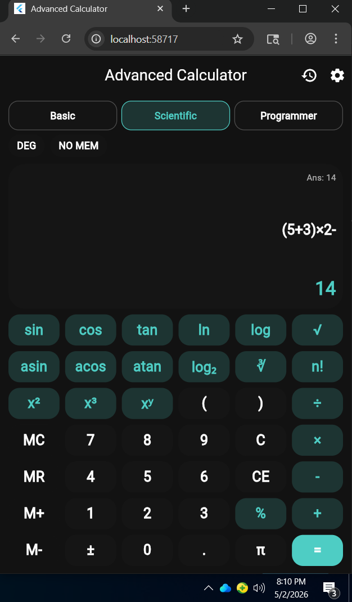
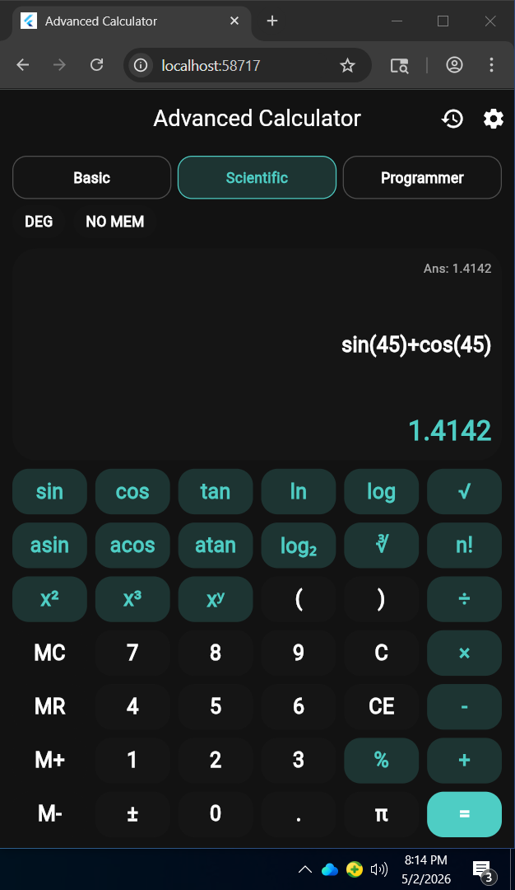
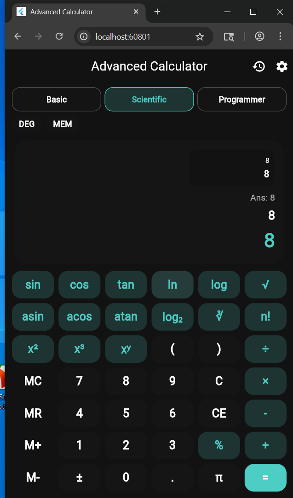
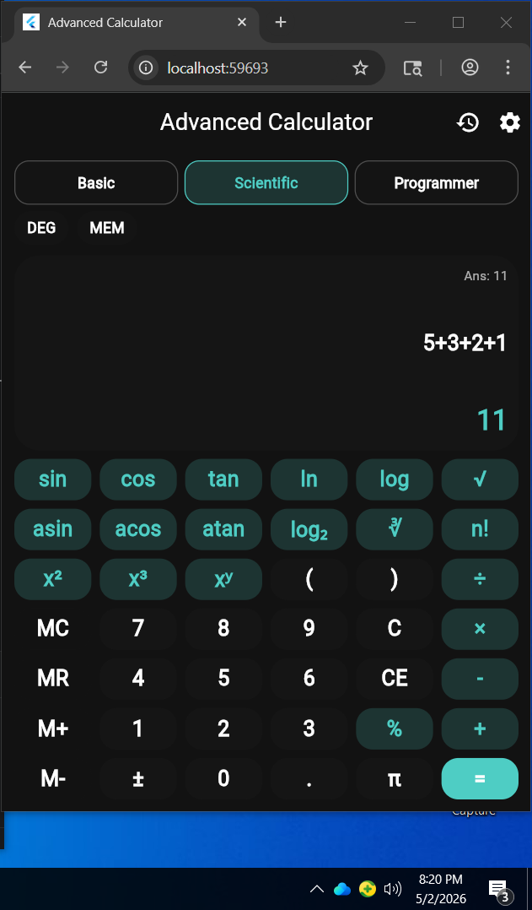
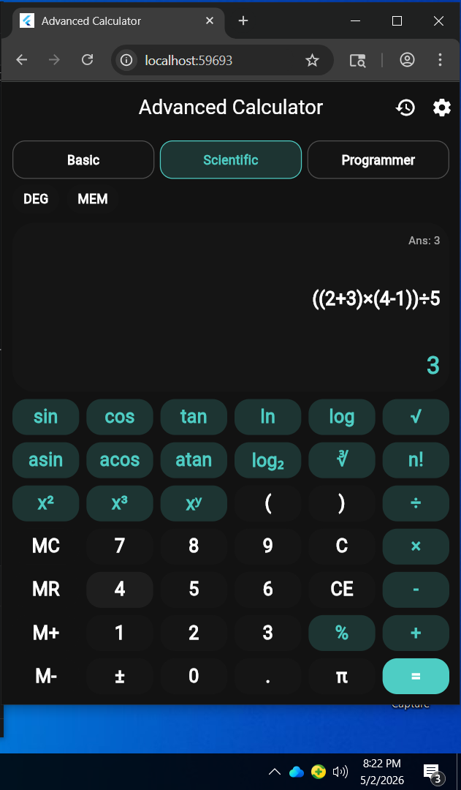
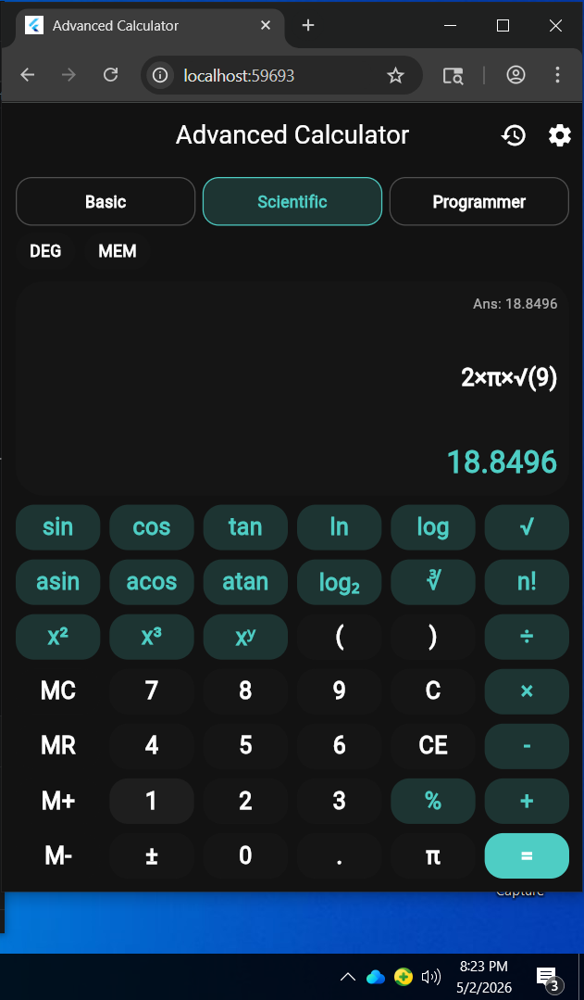
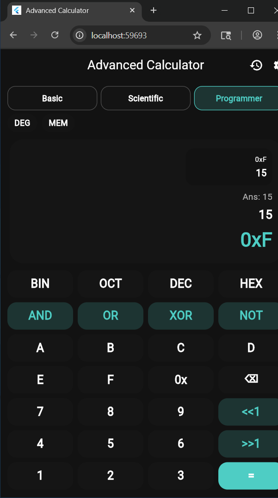

# Lab 3 - Advanced Calculator

## 1. Objective

Trong bài này, em nâng cấp ứng dụng máy tính cơ bản thành máy tính nâng cao. Mục tiêu của em là làm được giao diện tốt hơn, có nhiều chế độ tính toán, xử lý biểu thức phức tạp, lưu lịch sử, lưu cài đặt và có test cho phần tính toán.

## 2. Responsibilities

Em cần hoàn thành các trách nhiệm chính sau:

- Em cải tiến UI bằng theme sáng/tối, hiệu ứng nhấn nút, bố cục responsive và vùng hiển thị rõ ràng.
- Em thêm các hàm khoa học như `sin`, `cos`, `tan`, `asin`, `acos`, `atan`, `ln`, `log`, `log₂`, lũy thừa, căn bậc hai, căn bậc ba và giai thừa.
- Em cài đặt parser để tính biểu thức có đúng thứ tự ưu tiên, dấu ngoặc và nhân ngầm như `2π`.
- Em lưu lịch sử tính toán bằng `SharedPreferences`.
- Em tạo 3 chế độ: Basic, Scientific và Programmer.
- Em thêm memory functions gồm `M+`, `M-`, `MR`, `MC`.
- Em thêm màn hình Settings để chỉnh theme, số chữ số thập phân, DEG/RAD, phản hồi và số lượng lịch sử.
- Em viết unit test cho các phép tính quan trọng trong file `test/calculator_logic_test.dart`.

## 3. Resources và thiết kế

Đề bài yêu cầu dùng các package:

- `provider`: em dùng để quản lý state cho calculator, theme và history.
- `shared_preferences`: em dùng để lưu theme, mode, settings, memory value và lịch sử.
- `intl`: em dùng để định dạng thời gian ở màn hình lịch sử.
- `math_expressions`: đã được khai báo trong `pubspec.yaml`; phần parser hiện tại em tự xử lý để hỗ trợ đúng các nút trong app.

Về màu sắc, em giữ theo đặc tả:

- Light theme: primary `#1E1E1E`, secondary `#424242`, accent `#FF6B6B`.
- Dark theme: primary `#121212`, secondary `#2C2C2C`, accent `#4ECDC4`.

## 4. Step 1 - Project Setup

Project của em nằm trong thư mục `advanced_calculator`. Trong `pubspec.yaml`, em đã khai báo các dependency cần thiết như `provider`, `shared_preferences`, `intl`, `math_expressions` và `mockito`.

## 5. Step 2 - Project Structure

Em tổ chức project theo kiến trúc tách lớp:

- `models/`: chứa dữ liệu như lịch sử, mode và settings.
- `providers/`: chứa state của calculator, theme và history.
- `screens/`: chứa các màn hình chính, lịch sử và cài đặt.
- `widgets/`: chứa các widget tái sử dụng như display, button grid, button và mode selector.
- `utils/`: chứa logic tính toán, parser biểu thức và constants.
- `services/`: chứa service lưu dữ liệu bằng `SharedPreferences`.

## 6. Step 3 - Advanced UI Implementation

Ở vùng hiển thị, em làm các phần:

- Hiển thị biểu thức hiện tại.
- Hiển thị kết quả.
- Hiển thị kết quả trước đó bằng `Ans`.
- Hiển thị lỗi khi biểu thức sai.
- Hiển thị preview 3 lịch sử gần nhất và cho phép bấm để dùng lại.

Ở vùng nút bấm, em chia theo mode:

- Basic mode dùng lưới 4 cột.
- Scientific mode dùng lưới 6 cột với các hàm khoa học và memory.
- Programmer mode có chuyển đổi hệ số, toán tử bit và nhập giá trị hex.

## 7. Step 4 - Advanced Functionality

Em xử lý biểu thức trong `ExpressionParser` theo thứ tự:

1. Chuẩn hóa ký hiệu như `×`, `÷`, `π`, `√`, `∛`.
2. Thêm nhân ngầm cho trường hợp như `2π` hoặc `2(3+4)`.
3. Parse theo thứ tự ưu tiên: ngoặc, hàm, lũy thừa, nhân/chia/chia dư, cộng/trừ.
4. Báo lỗi khi biểu thức sai hoặc chia cho 0.

Các hàm khoa học đã có:

- Lượng giác: `sin`, `cos`, `tan`, `asin`, `acos`, `atan`.
- Logarithm: `ln`, `log`, `log₂`.
- Lũy thừa và căn: `x²`, `x³`, `xʸ`, `√`, `∛`.
- Hằng số: `π`, `e`.
- Giai thừa: `n!`.

## 8. Step 5 - Advanced Features

Em đã cài đặt:

- Theme system: chọn Light, Dark hoặc System.
- Data persistence: lưu history, theme, calculator mode, memory value, angle mode và settings.
- Gesture support: vuốt ngang để xóa ký tự cuối, vuốt lên để mở lịch sử, pinch để đổi kích thước font.
- Animations: nút có hiệu ứng scale, chuyển mode dùng animated container, kết quả dùng animated switcher.

## 9. Step 6 - Settings Screen

Màn hình cài đặt của em có:

- Chọn theme Light/Dark/System.
- Chỉnh decimal precision từ 2 đến 10.
- Chọn DEG/RAD.
- Bật/tắt haptic feedback.
- Bật/tắt sound effects.
- Chọn history size 25/50/100.
- Xóa toàn bộ lịch sử bằng dialog xác nhận.

## 10. Step 7 - Testing Requirements

Em viết unit test cho phần logic tính toán trong `test/calculator_logic_test.dart`. Các test tập trung vào parser và kết quả tính toán vì đây là phần dễ ảnh hưởng đến độ đúng của app nhất.

## 11. Step 8 - Complex Test Scenarios

Em đã test các tình huống:

- `(5 + 3) × 2 - 4 ÷ 2 = 14`.
- `sin(45°) + cos(45°) ≈ 1.414`.
- `((2 + 3) × (4 - 1)) ÷ 5 = 3`.
- `2 × π × √9 ≈ 18.85`.
- `log₂`, lũy thừa, căn bậc ba và giai thừa.
- Biểu thức lỗi như chia cho 0.

## 12. Bang test tinh toan theo de

Phan nay em trinh bay tung yeu cau test trong de. Khi chup anh thu cong, em dat anh vao thu muc `screenshots/` va dat dung ten file duoi day de Markdown hien thi duoc anh.

### 12.1 Complex expressions

- Yeu cau trong de: `(5 + 3) x 2 - 4 / 2 = 14`.
- Bieu thuc em nhap tren app: `(5+3)×2-4÷2`.
- Ket qua mong doi: `14`.
- Giai thich: em tinh phan trong ngoac truoc, `(5+3)=8`; sau do `8×2=16`; tiep theo `4÷2=2`; cuoi cung `16-2=14`.
- File test code: `test/calculator_logic_test.dart`.
- Ten anh can chup: `screenshots/test_01_complex_expression.png`.



### 12.2 Scientific calculations

- Yeu cau trong de: `sin(45°) + cos(45°) ≈ 1.414`.
- Bieu thuc em nhap tren app: `sin(45)+cos(45)`.
- Dieu kien: em bat che do `DEG`.
- Ket qua mong doi: gan bang `1.414`.
- Giai thich: trong che do do, `sin(45°)` va `cos(45°)` deu xap xi `0.7071`, nen tong xap xi `1.4142`.
- File test code: `test/calculator_logic_test.dart`.
- Ten anh can chup: `screenshots/test_02_scientific_deg.png`.



### 12.3 Memory operations

- Yeu cau trong de: `5 M+ 3 M+ MR = 8`.
- Cac buoc em thuc hien tren app:
  1. Nhap `5`, bam `M+`.
  2. Nhap `3`, bam `M+`.
  3. Bam `MR`.
- Ket qua mong doi: `8`.
- Giai thich: `M+` lan dau luu `5` vao bo nho, `M+` lan hai cong them `3`, nen gia tri bo nho la `8`; `MR` goi lai gia tri nay.
- Ten anh can chup: `screenshots/test_03_memory_operations.png`.



### 12.4 Chain calculations

- Yeu cau trong de: `5 + 3 = + 2 = + 1 = 11`.
- Cac buoc em thuc hien tren app:
  1. Nhap `5+3`, bam `=`, ket qua la `8`.
  2. Dung ket qua tiep tuc cong `2`, ket qua la `10`.
  3. Dung ket qua tiep tuc cong `1`, ket qua la `11`.
- Ket qua mong doi: `11`.
- Giai thich: day la phep tinh noi tiep, moi lan bam `=` thi ket qua truoc duoc dung lam gia tri cho buoc sau.
- Ten anh can chup: `screenshots/test_04_chain_calculations.png`.



### 12.5 Parentheses nesting

- Yeu cau trong de: `((2 + 3) x (4 - 1)) / 5 = 3`.
- Bieu thuc em nhap tren app: `((2+3)×(4-1))÷5`.
- Ket qua mong doi: `3`.
- Giai thich: em tinh `(2+3)=5`, `(4-1)=3`, sau do `5×3=15`, cuoi cung `15÷5=3`.
- File test code: `test/calculator_logic_test.dart`.
- Ten anh can chup: `screenshots/test_05_nested_parentheses.png`.



### 12.6 Mixed scientific

- Yeu cau trong de: `2 x pi x sqrt(9) ≈ 18.85`.
- Bieu thuc em nhap tren app: `2×π×√9` hoac `2π√9`.
- Ket qua mong doi: gan bang `18.85`.
- Giai thich: `√9=3`, nen bieu thuc thanh `2×π×3 = 6π`, xap xi `18.8495`.
- File test code: `test/calculator_logic_test.dart`.
- Ten anh can chup: `screenshots/test_06_mixed_scientific.png`.



### 12.7 Programmer mode

- Yeu cau trong de: `0xFF AND 0x0F = 0x0F`.
- Cac buoc em thuc hien tren app:
  1. Chuyen sang `Programmer`.
  2. Nhap `0xFF`.
  3. Bam `AND`.
  4. Nhap `0x0F`.
  5. Bam `=`.
  6. Bam `HEX` neu muon hien thi ket qua theo he 16.
- Ket qua mong doi: `0x0F` hoac gia tri thap phan tuong ung la `15`.
- Giai thich: `FF` trong he 16 co tat ca bit thap la `1`, con `0F` chi giu 4 bit cuoi; phep `AND` giu lai phan trung nhau nen ket qua la `0F`.
- Ten anh can chup: `screenshots/test_07_programmer_and.png`.



## 13. Vi tri anh can chup thu cong

Tat ca anh minh hoa em dat trong thu muc:

```text
advanced_calculator/screenshots/
```

Danh sach ten anh can dat:

- `test_01_complex_expression.png`
- `test_02_scientific_deg.png`
- `test_03_memory_operations.png`
- `test_04_chain_calculations.png`
- `test_05_nested_parentheses.png`
- `test_06_mixed_scientific.png`
- `test_07_programmer_and.png`
- `mode_basic.png`
- `mode_scientific.png`
- `mode_programmer.png`
- `screen_history.png`
- `screen_settings.png`

Neu muon them anh tong quan giao dien, em co the chen them cac anh `mode_basic.png`, `mode_scientific.png`, `mode_programmer.png`, `screen_history.png`, `screen_settings.png` vao README.

## 14. Outcome

Sau khi hoàn thành, app của em có máy tính chuyên nghiệp hơn với 3 chế độ, giao diện sáng/tối, lưu lịch sử, lưu cài đặt, memory functions, parser biểu thức phức tạp và unit test cho phần tính toán.

## 15. Way to Submit

Khi nộp bài, em cần chuẩn bị:

- Repository GitHub có README đầy đủ.
- Source code zip theo tên `AdvancedCalculator_2224802010263_LeVieThang.zip`.
- Không đưa các thư mục build tạm như `build/`, `.dart_tool/`, `.idea/`.
- Có thư mục `test/` và `docs/`.
- Ghi chú những tính năng đã làm, khó khăn gặp phải và cách giải quyết.

## 16. Grading Criteria

Em đối chiếu bài làm với tiêu chí chấm điểm:

- UI nâng cao: có theme, animation và layout responsive.
- Chức năng chính: có 3 mode, parser và scientific functions.
- Tính năng nâng cao: có history, memory, settings và persistence.
- Code quality: project tách models, providers, screens, widgets, utils và services.
- Testing: có unit test cho logic tính toán.
- Documentation: có README và file giải thích lab này.

## 17. Academic Integrity

Em có thể tham khảo tài liệu, nhưng phần code và cách tổ chức bài phải là bài làm của em. Em không sao chép nguyên project của người khác để tránh vi phạm học thuật.
